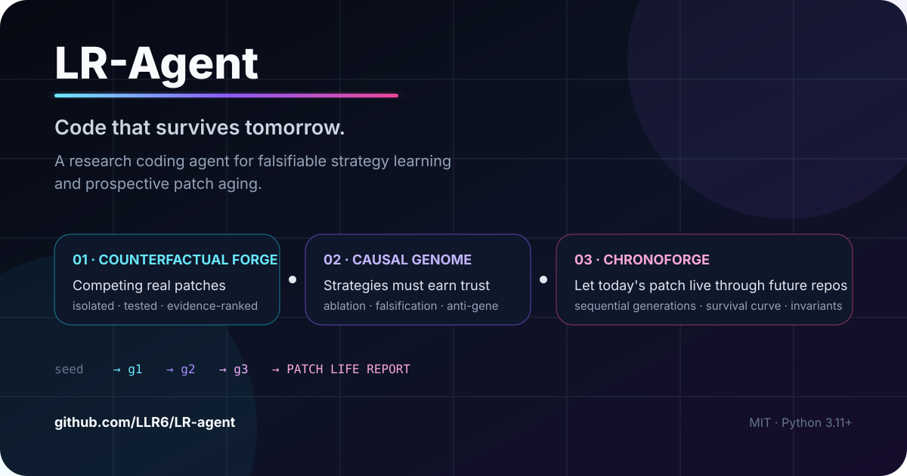
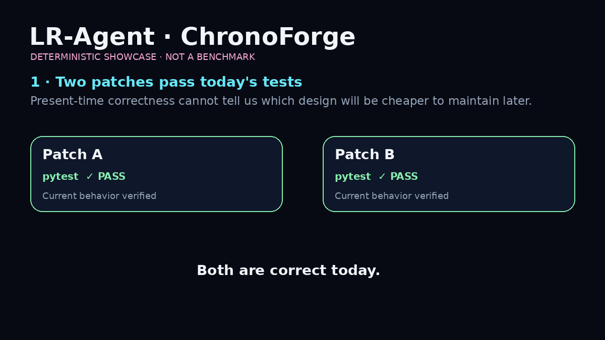

# LR-Agent

<!-- LR-LAB-CHROME:START -->
<p align="center">
  <a href="https://github.com/LLR6"></a>
  
</p>
<p align="center"><strong>Code that survives tomorrow.</strong><br><sub>Counterfactual patches · causal evidence · repository aging</sub></p>
<p align="center"><a href="https://github.com/LLR6/LR-agent/stargazers"></a>
   </p>
<p align="center"><a href="https://github.com/LLR6">Profile</a> · <a href="https://github.com/LLR6?tab=repositories">All projects</a> · <a href="https://github.com/LLR6/LR-agent/issues">Issues</a></p>
<!-- LR-LAB-CHROME:END -->

<!-- LR-PROJECT-DOCS:START -->
### Project docs
[Research](./docs/research/README.md) · [Benchmarks](./docs/BENCHMARKS.md) · [Roadmap](./docs/ROADMAP.md) · [Compatibility](./docs/COMPATIBILITY.md) · [Releasing](./docs/RELEASING.md) · [Security](./SECURITY.md) · [Contributing](./CONTRIBUTING.md) · [Support](./SUPPORT.md)
<!-- LR-PROJECT-DOCS:END -->


<p align="center"></p>

<p align="center"></p>
<p align="center"><sub>Deterministic showcase for explaining the workflow; not a benchmark result.</sub></p>

<p align="center"><a href="./docs/media/chronoforge-showcase.mp4">▶ Watch / download the MP4 teaser</a></p>

<p align="center">
  <strong>A coding agent that asks not only “does this patch work today?” — but “can it survive tomorrow?”</strong>
</p>

<p align="center">
  让代码在合并前先经历未来：竞争补丁、策略证伪、连续仓库演化、原行为重放与长期不变量验证。
</p>

<p align="center">
  <a href="./README_EN.md">English</a> ·
  <a href="https://github.com/LLR6/LR-agent/releases/tag/v1.1.0">v1.1.0 Release</a> ·
  <a href="./docs/DEMO_CHRONOFORGE.md">5 分钟 Demo</a> ·
  <a href="./docs/research/README.md">Research</a> ·
  <a href="./CONTRIBUTING.md">Contributing</a>
</p>

<p align="center">
  <a href="https://codespaces.new/LLR6/LR-agent?quickstart=1"></a>
</p>

<p align="center">
  
  
  
  
  <a href="https://github.com/LLR6/LR-agent/stargazers"></a>
</p>


> **TL;DR — LR-Agent is an experimental coding-agent lab for testing whether a patch stays reliable after the repository changes.**  
> It combines isolated candidate patches, evidence-based strategy validation, and multi-generation repository aging instead of stopping at “tests pass today”.

### Start here

| If you want to… | Open this |
|---|---|
| See the idea in 90 seconds | [ChronoForge showcase](./docs/media/chronoforge-showcase.gif) |
| Run a local demo | [5-minute demo](./docs/DEMO_CHRONOFORGE.md) |
| Read the research framing | [Research notes](./docs/research/README.md) |
| Check what is implemented vs still a hypothesis | [Claim Ledger](./docs/research/CLAIM_LEDGER.md) |
| Inspect the implementation | [`lr_agent/`](./lr_agent) |
| Check reproducibility | [Tests](./tests) · [CI](https://github.com/LLR6/LR-agent/actions) |

**Why it may be worth following:** the project is exploring a concrete question that most coding agents largely ignore — *how do we compare two patches that both pass today, but age differently under future maintenance?*

If that question is useful to your own Agent / software-reliability work, a ⭐ helps you find the project again as the experiments evolve.


## 30 秒看懂 LR-Agent

普通 Coding Agent 的闭环通常是：

```text
任务 → 生成 Patch → 当前测试通过 → 完成
```

LR-Agent 把“完成”往后推：

```text
                         ┌─ Patch A ─┐
当前任务 → Counterfactual├─ Patch B ─┼→ 真实测试 / Evidence
            Forge        └─ Patch C ─┘
                                  │
                                  ▼
                         Causal Genome
                    策略先证伪，再进入长期记忆
                                  │
                                  ▼
                           ChronoForge
                 让 Patch 在连续未来仓库中老化
                                  │
              ┌───────────────────┼───────────────────┐
              ▼                   ▼                   ▼
         dependency          API/schema          adjacent
          upgrade             evolution           feature
              │                   │                   │
              └──────────── sequential generations ──┘
                                  │
                                  ▼
                   replay original checks + invariants
                                  │
                                  ▼
                         PATCH LIFE REPORT
```

**核心区别：两个 Patch 今天都能通过测试，不代表它们未来同样好维护。**

## 三个最值得看的能力

### ⚡ Counterfactual Forge

同一个 Coding 任务放进多个隔离 Shadow Workspace，用不同策略真实改代码、跑命令、跑测试，再按可观察证据比较。胜者不会直接覆盖真实工作区；晋升前有基线冲突检测，晋升后还会在真实 workspace 重新验证，失败自动恢复。

### 🧬 Causal Genome

LR-Agent 不把“一次成功”直接记成长期技能。候选策略先进入 `quarantine`，再做 Treatment vs Control 消融、主动证伪、Anti-Gene、血缘污染传播与 Proof-Carrying Gene 验证。只有积累足够证据的 Gene 才进入正常 Agent 上下文。

### ⏳ ChronoForge

把当前 workspace 或 Forge 候选复制到多条未来时间线。**generation N 真正继承 generation N-1 的代码**，未来维护 Agent 会继续修改仓库；每一代都会重放 Seed 验证和 Invariant DNA，最终得到：

- Temporal Survival Curve
- Future Maintenance Cost
- Maintenance Option Value
- Invariant Survival
- Dependency Robustness
- Patch Surface Stability
- repository-generation Half-Life
- Temporal Death Modes

> 当前版本：**1.1.0**。ChronoForge 是研究型工程原型：未来场景和 Option Value 是可审计的工程启发式，不是“能预测现实未来”的宣传口号。

## 30 秒试玩（不用 clone）

如果你装了 `uv`，可以直接从 GitHub 启动 CLI：

```bash
uvx --from git+https://github.com/LLR6/LR-agent.git lr-agent --help
```

进入完整功能前仍需要配置一个 OpenAI-compatible 模型；但查看 CLI、命令结构和本地 Demo 环境不需要先手动创建项目虚拟环境。

## 5 分钟开始

要求 Python 3.11+。

```bash
git clone https://github.com/LLR6/LR-agent.git
cd LR-agent
python -m venv .venv
```

Windows PowerShell：

```powershell
.\.venv\Scripts\Activate.ps1
pip install -e ".[dev]"
Copy-Item .env.example .env
```

Linux / macOS：

```bash
source .venv/bin/activate
pip install -e ".[dev]"
cp .env.example .env
```

在 `.env` 配好一个 OpenAI-compatible 模型后：

```bash
lr-agent doctor
lr-agent serve
```

然后可以直接试：

```bash
# 多个隔离候选竞争
lr-agent forge "修复当前项目测试失败，必须真实验证" --evolve

# 让当前实现先经历未来维护压力
lr-agent chrono "保持当前核心行为" --generations 4 --trajectories 3
```

想看一个最小、可复现的 ChronoForge 演示：

**→ [5-minute ChronoForge Demo](./docs/DEMO_CHRONOFORGE.md)**

## 为什么这个仓库值得关注

LR-Agent 不是把 Planner / Reviewer / RAG 再组合一遍，而是在实验几个更具体的问题：

- **成功经验到底是不是导致成功的原因？**
- **Agent 学错了之后，如何保留反例而不是只删记录？**
- **项目长期必须保持的约束，能否独立于任务/策略存在？**
- **一个今天正确的 Patch，能不能在合并前先接受“未来维护压力测试”？**
- **现实后来发生的仓库变化，能否反过来校准 Future Model？**

完整研究边界、相关工作、可证伪实验和 benchmark 计划都公开在 [`docs/research/`](./docs/research/README.md)。

## 参与 / Help Wanted

如果你想直接参与，下面这些 Issue 已经拆成可执行任务：

- [#1 Chrono Tournament](https://github.com/LLR6/LR-agent/issues/1) — 让多个今天都正确的 Patch 进入同一套 Future Matrix
- [#2 Retrospective Benchmark](https://github.com/LLR6/LR-agent/issues/2) — 用真实后续仓库历史验证 ChronoForge
- [#3 30–60 秒真实 Demo](https://github.com/LLR6/LR-agent/issues/3) — 录制 Forge → ChronoForge → Life Report
- [#5 Counterexample Thread](https://github.com/LLR6/LR-agent/issues/5) — 专门收集打脸案例和误导性结果

**反例比“看起来很牛”更有价值。** 如果你找到一个能让 ChronoForge、Causal Genome 或 Invariant DNA 得出错误结论的最小案例，欢迎直接提 Issue。

## Research / 研究入口

- **[Research Program](./docs/research/README.md)** — 总体研究问题
- **[State of the Art](./docs/research/STATE_OF_THE_ART.md)** — 相关工作与边界
- **[Causal Genome](./docs/research/CAUSAL_GENOME.md)** — 可证伪策略记忆
- **[ChronoForge](./docs/research/CHRONOFORGE.md)** — 前瞻式 Patch Aging
- **[Novelty Claims](./docs/research/NOVELTY_CLAIMS.md)** — 哪些能说、哪些不能说
- **[Experiments](./docs/research/EXPERIMENTS.md)** — Benchmark / Ablation / 统计设计
- **[Roadmap](./docs/research/ROADMAP.md)** — Chrono Tournament 等下一阶段
- **[Implementation Map](./docs/research/IMPLEMENTATION_MAP.md)** — 研究概念对应源码和测试

## 已实现

- OpenAI-compatible 模型接口，可接云端兼容接口或本地 Ollama 等服务
- Planner / Executor / Reviewer：Coder、Research 模式会先生成可验证计划，执行后再由 Reviewer 检查是否真的完成
- Tool Calling 自主循环：模型 -> 工具 -> 工具结果 -> 模型，最多执行 `LR_AGENT_MAX_STEPS` 步
- Reviewer 发现未完成项时可自动返工，次数由 `LR_AGENT_MAX_REVIEW_RETRIES` 控制
- 交互式审批：`off / writes / all` 三种模式；Web UI 会实时弹出待审批 Diff/命令/GitHub 写操作，CLI 也会询问 y/N
- 后台任务队列：Web 请求不再一直阻塞等待 Agent；任务状态会持久化，服务重启后未完成任务会标记为 interrupted
- 有界并发：默认最多同时运行 2 个后台任务，其余任务保持 queued；排队任务也可以取消
- WebSocket 实时执行流：Planner、Run、Tool Step、Reviewer、完成状态会实时推送给 Web UI
- 项目知识索引：可把 workspace 文本文件分块写入 SQLite，优先使用 FTS5/BM25 检索；Coder / Research 默认会自动检索相关上下文再规划和执行
- 混合 RAG：可选调用 OpenAI-compatible `/embeddings` 接口，把持久化向量语义分数与 FTS5/LIKE 词法结果融合排序；Embedding 服务不可用时自动回退到词法检索
- **Counterfactual Forge**：同一 Coding 任务复制到 2～4 个隔离 Shadow Workspace，由 Surgical / Root-Cause / Adversarial / Architecture 等不同策略并行求解，真实修改、真实执行测试，但不触碰主 workspace
- **策略进化**：可根据首轮候选的测试、Reviewer、失败工具、修改规模等可观察证据，让模型生成一个新的 Evolved Strategy，再进入新隔离宇宙竞争
- **Evidence Score**：候选不是靠“谁说得像”，而是综合 Reviewer 结果、真实测试退出码、工具失败、修改范围等证据进行可解释评分
- **冲突感知晋升**：Forge 开始时记录主工作区基线哈希；晋升前再次检查，如果用户或其他 Agent 后来改过同一路径，则拒绝覆盖
- **Proof-Carrying Patch**：胜者晋升后会在真实 workspace 重放它的验证命令；失败就自动回滚，成功则生成带变更、证据、复验结果和 SHA-256 的机器可读 Proof Bundle
- **Causal Genome**：Forge 胜者可以进入策略基因隔离区，但默认保持 `quarantine`；一次成功只算 provenance，不算因果证据
- **Treatment vs Control 消融**：同一个真实任务分别在两个隔离 Universe 中运行“使用 Gene”和“独立解决不用 Gene”，比较真实验证证据的边际差值；可运行 1～5 个独立 trial
- **Falsification Mode**：Treatment Agent 会主动寻找该 Gene 的不适用条件、边界和反例，而不是为了证明 Gene 正确而强行套用
- **Anti-Gene**：当 Gene 在受控消融中明显有害时，不直接删除失败经验，而是生成上下文特定的反基因，告诉后续 Agent“哪些情况下不要盲用”
- **Genealogy / Contamination Graph**：派生 Gene 记录父子血缘；当祖先来源被发现污染，可把 distrust 传播给整棵后代子树并降低置信度
- **Proof-Carrying Gene**：Gene 可携带自己的可执行 verifier；Treatment 和 Control 都会在各自 Shadow Workspace 中额外执行同一套 verifier，失败候选会被证据评分惩罚
- **Invariant DNA**：保存“这个项目长期必须保持什么”的可执行不变量；Forge 胜者即使自己的测试通过，只要真实 workspace 上破坏任一 active invariant，也会自动回滚
- **Epistemic Tripwire**：检测重复相同失败、同一路径在没有成功验证的情况下被连续修改等早期失控信号，触发后向 Agent 注入“停止机械重复、重新检查假设、先做区分性诊断”的约束
- **Genome Jobs**：A/B 消融和主动证伪作为持久化后台实验运行，服务重启后未完成实验标记为 interrupted，而不是悄悄消失
- **ChronoForge 连续未来老化**：不是独立问多个“如果”，而是 generation N 真正继承 generation N-1 的代码，再执行下一次未来维护事件
- **Patch Life Report**：输出 Temporal Survival、Future Maintenance Cost、Maintenance Option Value、Invariant Survival、Dependency Robustness、Patch Surface Stability 与 repo-generation Half-Life
- **Reality-Calibrated Future Model**：真实项目后来发生的 dependency/API/schema 等事件可以通过 `chrono-observe` 回写，使用平滑后的类别权重影响后续未来场景优先级
- **Seed Verification Replay**：如果从 Forge 候选开始老化，会保留候选原始验证命令；如果从当前 workspace 开始，会读取 `project_inspect` 推荐检查。每一代未来都重新执行，不让“未来维护成功”掩盖原功能已经死掉
- **Temporal Death Modes**：记录代码最常在哪类未来压力下死亡，而不是只给一个总分
- **Shadow Future Maintainers**：所有未来 Agent 都运行在 ChronoForge Shadow Workspace，GitHub/发布等远端写操作保持禁止
- Shadow Universe 默认禁止 `git push`、`gh pr create`、`npm publish`、`cargo publish`、`mvn deploy` 等外部写操作
- 检索安全：自动召回的项目内容会明确标记为 **UNTRUSTED PROJECT DATA**，不会被当作系统指令
- 文件工具：列目录、全文搜索、按行读取、写文件、精确替换、单文件删除/移动、创建目录；写入/替换会返回统一 Diff
- 项目识别：`project_inspect` 会识别 Python / Node / Rust / Go / Maven / Gradle / CMake / Git，并返回建议的测试/构建检查命令
- Git 只读工具：git status / git diff
- 命令工具：**不经过 shell**，只允许配置白名单中的可执行程序；使用 asyncio 子进程，stdout/stderr 会通过 WebSocket 实时推送，任务取消/超时时会终止当前子进程
- Web UI 可以直接取消正在运行或仍在排队的后台任务，并实时查看命令输出
- Run 级文件快照：直接文件写入/替换/删除/移动/建目录会在执行前记录原始状态
- 冲突感知回滚：回滚前会比较 Run 结束时记录的最终哈希与当前工作区；如果文件后来被别人或另一个任务改过，则拒绝回滚而不是覆盖新改动
- HTTP 工具：GET 公网资源；默认拦截 localhost / 私网 / link-local / reserved 地址
- SQLite 会话记忆 + 每次 Run 的计划、工具调用证据、最终状态和 Review 持久化
- 中断恢复：Web UI 可点“继续此任务”，CLI 可用 `lr-agent resume RUN_ID`
- GitHub 原生工具：仓库元数据、目录、文件、Actions；显式开启后可建 Issue、分支、写文件、开 PR
- General / Coder / Research 三种工作模式
- FastAPI 后端 + 本地 Web 控制台
- CLI：`serve` / `chat` / `forge` / `chrono` / `chrono-list` / `chrono-show` / `chrono-observe` / `genome-add` / `genome-import` / `genome-list` / `genome-ablate` / `genome-falsify` / `genome-contaminate` / `invariant-add` / `invariant-list` / `invariant-check` / `tasks` / `runs` / `resume` / `rollback` / `index` / `search` / `doctor`
- Web/API 可选 Bearer Token 鉴权；WebSocket 同样受保护
- 非本机监听默认要求 Web Token；Docker Compose 默认只把 8765 发布到宿主机 loopback
- Docker / docker compose
- pytest 单元测试 + GitHub Actions CI
- 对 API Key、危险 Git 命令、目录穿越做基础防护

## 1. 本地安装

要求 Python 3.11+。

```bash
git clone https://github.com/LLR6/LR-agent.git
cd LR-agent

python -m venv .venv
```

Windows PowerShell：

```powershell
.\.venv\Scripts\Activate.ps1
pip install -e ".[dev]"
Copy-Item .env.example .env
```

Linux / macOS：

```bash
source .venv/bin/activate
pip install -e ".[dev]"
cp .env.example .env
```

然后编辑 `.env`，至少配置模型：

```env
LR_AGENT_BASE_URL=https://api.openai.com/v1
LR_AGENT_API_KEY=你的_API_KEY
LR_AGENT_MODEL=你实际可用的模型名
```

不要把真实 API Key 提交到 GitHub；`.env` 已加入 `.gitignore`。

## 2. 先运行自检

```bash
lr-agent doctor
```

成功时会看到模型 endpoint 返回测试响应。失败时会直接显示 HTTP 状态码或连接错误，不会假装连接成功。

## 3. 启动 Web UI

```bash
lr-agent serve
```

浏览器打开：

```text
http://127.0.0.1:8765
```

你可以切换：

- **General**：普通个人助手
- **Coder**：优先检查项目、修改代码、运行测试
- **Research**：优先收集公开资料并保留来源 URL

## 4. CLI 使用

一次性任务：

```bash
lr-agent chat --mode coder "检查 workspace 中的项目，找出测试失败原因并修复"
```

交互模式：

```bash
lr-agent chat --mode general
```

输入 `/exit` 退出。

查看后台 Task 与 Run：

```bash
lr-agent tasks
lr-agent runs
```

启动 3 个平行 Coding Universe：

```bash
lr-agent forge "修复当前项目测试失败，必须真实跑测试"
```

首轮之后再进化一个新策略：

```bash
lr-agent forge "修复当前项目测试失败" --evolve
```

完成后直接进入“确认后晋升”流程：

```bash
lr-agent forge "修复当前项目测试失败" --evolve --promote
```

历史 Forge：

```bash
lr-agent forge-list
lr-agent forge-promote <tournament_id>
```

建立并搜索项目知识索引：

```bash
lr-agent index
lr-agent search "authentication flow"
```

恢复某一轮任务：

```bash
lr-agent resume <run_id>
```

安全回滚某个 Run 的直接文件改动：

```bash
lr-agent rollback <run_id>
```

脚本化场景可以显式跳过确认：

```bash
lr-agent rollback <run_id> --yes
```

## 5. 接本地 Ollama

如果你的 Ollama 提供 OpenAI-compatible `/v1` 接口，可以这样配置：

```env
LR_AGENT_BASE_URL=http://127.0.0.1:11434/v1
LR_AGENT_API_KEY=ollama
LR_AGENT_MODEL=你本机已经安装的模型名
```

这里的模型名必须与你本机实际安装的一致。

## 6. Agent 真正怎么执行任务

例如：

```text
检查 workspace 里的 Python 项目。
先看目录和测试，再修复失败项，修改后重新跑 pytest。
不要声称成功，除非测试真的通过。
```

执行路径：

```text
User
  ↓
LLM
  ↓ tool_calls
ToolRegistry
  ├─ list_files
  ├─ search_files
  ├─ read_file
  ├─ write_file
  ├─ delete_file
  ├─ move_file
  ├─ make_directory
  ├─ replace_in_file
  ├─ project_inspect
  ├─ git_status
  ├─ git_diff
  ├─ run_command
  ├─ http_get
  ├─ knowledge_index
  ├─ knowledge_search
  ├─ knowledge_stats
  ├─ github_get_repo
  ├─ github_list_contents
  ├─ github_read_file
  ├─ github_list_workflow_runs
  ├─ github_create_issue *
  ├─ github_create_branch *
  ├─ github_put_file *
  └─ github_create_pull_request *
  ↓
tool result
  ↓
LLM 再判断
  ↓
继续调用工具 / 返回最终答案
```

Web UI 右侧会显示 **Task / Run ID、Plan、实时工具调用、LIVE OUTPUT、参数、Diff/输出证据、Reviewer 结论**。长命令运行时 stdout/stderr 会边执行边显示，不必等命令结束。带 `*` 的 GitHub 写操作默认关闭。

## 7. 工作区

默认情况下 Agent 只能通过文件工具访问：

```text
./workspace
```

可以修改：

```env
LR_AGENT_WORKSPACE=D:/Projects/my-project
```

注意：文件工具有路径边界检查，但命令工具不是完整的 OS 沙箱。详细限制见 [SECURITY.md](SECURITY.md)。

## 8. 命令白名单

默认：

```env
LR_AGENT_ALLOWED_COMMANDS=python,python3,pytest,git,gh,pip,uv,pwd,ls,dir,find,where,node,npm,npx,pnpm,yarn,java,javac,mvn,gradle,gradlew,gradlew.bat,cargo,go,cmake,ctest
```

`run_command` 直接用 argv 调用程序，不使用 `shell=True`。

默认还会拦截一部分危险操作，例如：

```text
git reset --hard
git clean ...
git push --force
git push -f
git checkout -- .
git restore .
pip uninstall
```

只有显式设置下面配置才放开这类检查：

```env
LR_AGENT_ALLOW_DESTRUCTIVE=true
```

这并不等于完整安全沙箱。对于不可信仓库，建议使用 Docker 或临时虚拟机。

## 9. GitHub 原生工具

读取公开仓库不要求 Token。访问私有仓库或执行写操作时配置：

```env
LR_AGENT_GITHUB_TOKEN=你的_GitHub_Token
LR_AGENT_ALLOW_GITHUB_WRITE=false
```

默认 `false` 时，即使模型请求建 Issue / 分支 / PR / 改远程文件，也会被工具层拒绝。

确认你确实希望 Agent 修改 GitHub 后，再显式改为：

```env
LR_AGENT_ALLOW_GITHUB_WRITE=true
```

Token 不会作为普通工具参数传给模型。


## 10. 项目知识索引

Web UI 左侧可以直接点击 **“索引工作区知识库”**。也可以让 Agent 调用：

```text
knowledge_index
knowledge_search
knowledge_stats
```

索引默认会跳过 `.git`、`node_modules`、虚拟环境、构建目录和二进制文件，并按文本块写入：

```text
./data/knowledge.db
```

主要配置：

```env
LR_AGENT_KNOWLEDGE_DATABASE=./data/knowledge.db
LR_AGENT_KNOWLEDGE_MAX_FILES=3000
LR_AGENT_KNOWLEDGE_MAX_FILE_BYTES=1000000
LR_AGENT_AUTO_CONTEXT=true
LR_AGENT_AUTO_CONTEXT_RESULTS=6
```

建立索引后，Coder / Research 模式会在每轮任务开始时自动搜索相关上下文，并把召回的文件片段显示在 Web UI 的 **CONTEXT** 区域。召回内容会被当作不可信项目数据，Agent 仍需在改动前重新读取关键文件。

默认仍是本地 SQLite FTS5/BM25 检索，不依赖外部服务。需要语义召回时可以显式开启 Embeddings：

```env
LR_AGENT_KNOWLEDGE_EMBEDDINGS=true

# 留空时复用 LR_AGENT_BASE_URL / LR_AGENT_API_KEY
LR_AGENT_EMBEDDING_BASE_URL=
LR_AGENT_EMBEDDING_API_KEY=

LR_AGENT_EMBEDDING_MODEL=text-embedding-3-small
LR_AGENT_EMBEDDING_BATCH_SIZE=32

# 0~1，越大越偏向向量语义相似度
LR_AGENT_HYBRID_VECTOR_WEIGHT=0.45
```

开启后，重建索引会先写入文本 Chunk，再批量请求 `/embeddings`，向量以二进制 float32 持久化到同一个 SQLite 知识库。查询时对 query 生成向量，并与词法结果进行融合排序。

如果 Embedding Endpoint 请求失败，LR-Agent 会保留已经建立好的文本索引，并自动回退到 FTS5/LIKE，不会因为语义检索服务故障导致整个知识库不可用。

## 11. 后台任务与实时日志

Web UI 默认通过：

```text
POST /api/tasks
WS   /ws/tasks/{task_id}
```

提交和监听任务。任务元数据会持久化到 SQLite。默认最多同时执行 2 个任务：

```env
LR_AGENT_MAX_CONCURRENT_TASKS=2
```

超过并发上限的任务保持 `queued`，不会提前占用执行槽。

常用接口：

```text
GET  /api/tasks
GET  /api/tasks/{task_id}
POST /api/tasks/{task_id}/cancel
GET  /api/runs
GET  /api/runs/{run_id}
POST /api/runs/{run_id}/resume-task
```

恢复旧 Run 时也会重新进入后台队列，并重新检查当前 workspace 状态，而不是盲目沿用旧结果。


## 12. 交互式审批

默认关闭，不影响自动执行：

```env
LR_AGENT_APPROVAL_MODE=off
```

可选：

```env
# 写文件、替换文件、GitHub 写操作需要审批
LR_AGENT_APPROVAL_MODE=writes

# 上述操作 + run_command 都需要审批
LR_AGENT_APPROVAL_MODE=all

LR_AGENT_APPROVAL_TIMEOUT_S=600
```

开启后，后台任务遇到受控工具会进入 `approval_required` 状态事件。Web UI 右侧会显示：

```text
APPROVAL
WAITING · write_file

--- a/app.py
+++ b/app.py
@@ ...
-old
+new

[拒绝] [批准执行]
```

审批请求会持久化到 SQLite。服务重启时遗留的 pending 审批会标记为 expired，避免旧审批被错误复用。

API：

```text
GET  /api/tasks/{task_id}/approvals
POST /api/tasks/{task_id}/approvals/{approval_id}
```

请求体：

```json
{"approved": true}
```

CLI 在审批模式开启时，也会在真正执行前显示预览并询问：

```text
Approve this action? [y/N]:
```


## 13. Run 文件快照与安全回滚

默认开启：

```env
LR_AGENT_ENABLE_RUN_SNAPSHOTS=true
LR_AGENT_SNAPSHOT_MAX_FILE_BYTES=2000000
```

当 Agent 使用这些**直接文件工具**时，会在第一次修改每个路径之前记录原始状态：

```text
write_file
replace_in_file
delete_file
move_file
make_directory
```

同一个 Run 多次修改同一文件，只保留 Run 开始修改前的原始快照；每次修改后会更新该路径的最终状态和 SHA-256。

回滚时 LR-Agent 会先检查：

```text
当前文件状态 == 该 Run 最后记录的状态？
```

如果不一致，说明 Run 结束后又发生了其他修改，回滚会返回冲突并且**一个文件也不改**。

Web UI 的历史 Run 面板提供 **“回滚直接文件改动”** 按钮。API：

```text
GET  /api/runs/{run_id}/snapshots
POST /api/runs/{run_id}/rollback
```

重要限制：这个回滚机制只覆盖 LR-Agent 自己的直接文件工具。下面这些可能产生的副作用不在快照范围：

```text
run_command
npm / pip / gradle / cargo 等构建或包管理器
Git hooks
外部程序
远程 GitHub 写操作
```

因此它是 Coding Agent 的文件级安全网，不是操作系统快照。

## 14. Counterfactual Forge 与 Proof-Carrying Patch

普通 Coding Agent 往往只有一条时间线：

```text
任务 → 一个方案 → 改代码 → 测试
```

LR-Agent 可以主动建立多条互不影响的反事实时间线：

```text
                         ┌─ Surgical Minimalist ──┐
                         ├─ Root-Cause Hunter ────┤
真实 workspace → Baseline├─ Adversarial Breaker ──┼→ Evidence Tournament
                         └─ Architecture Gardener ┘
                                      │
                         可选：根据首轮证据进化
                                      ↓
                              Evolved Strategy
                                      │
                                      ↓
                               Evidence Winner
                                      │
                       基线冲突检测 + 用户确认
                                      ↓
                         临时应用到真实 workspace
                                      │
                         重放胜者真实验证命令
                              ┌───────┴───────┐
                           PASS             FAIL
                            ↓                 ↓
                       生成 Proof       自动恢复原文件
                            ↓
                       最终晋升完成
```

Web UI 输入任务后点击 **⚡ Forge**，默认启动 3 个隔离候选并额外生成一个 Evolved Strategy。普通 **执行** 按钮仍然走单 Agent 后台任务。

CLI：

```bash
lr-agent forge "修复登录模块偶发测试失败" --evolve
lr-agent forge-list
lr-agent forge-promote <tournament_id>
```

Forge 数据默认保存在：

```text
./data/universes/<tournament_id>/
├─ baseline.json
├─ tournament.json
├─ candidates/
│  ├─ surgical/
│  │  ├─ workspace/
│  │  └─ candidate.json
│  ├─ root-cause/
│  └─ ...
├─ promotion-backups/
└─ proofs/
```

主要配置：

```env
LR_AGENT_UNIVERSE_ROOT=./data/universes
LR_AGENT_UNIVERSE_CANDIDATES=3
LR_AGENT_UNIVERSE_MAX_FILES=5000
LR_AGENT_UNIVERSE_MAX_FILE_BYTES=5000000
LR_AGENT_UNIVERSE_EXCLUDES=.git,.venv,venv,node_modules,__pycache__,.pytest_cache,.mypy_cache,.ruff_cache,dist,build,data
```

### Evidence Score 不是“模型自评”

当前评分只使用可观察证据：

- Reviewer 是否通过
- 任务状态是否完成
- pytest / npm test / cargo test / go test / Maven / Gradle / ctest 等验证命令的真实退出码
- 工具失败数量
- 修改文件数量
- 有改动却没有真实验证时的惩罚

它只是**候选排序启发式**，不是数学意义上的正确性证明。因此晋升阶段还会在真实 workspace 再执行一次验证。

### 携证补丁

成功晋升后会生成：

```text
lr-agent-proof-carrying-patch/v1
```

Proof Bundle 包含：

- Tournament / Candidate / Strategy
- Evidence Score 组成
- Before / After 文件哈希
- 应用的文件列表
- 真实 workspace 复验命令
- 退出码与输出证据
- 整个 Proof Payload 的 SHA-256

如果真实 workspace 复验失败，LR-Agent 会使用晋升前备份自动恢复；不会留下一个“Shadow 里说成功、主环境实际坏了”的半成品。

## 15. Causal Genome Engine

普通“Agent Memory”常见做法是：

```text
这次成功
  ↓
总结成经验
  ↓
下次直接复用
```

LR-Agent 1.0 默认不相信这种单次归纳。Forge 胜者进入 Genome 时只获得：

```text
quarantine
```

而不是直接变成 active skill。

完整生命周期：

```text
Forge / 手工候选
      ↓
  QUARANTINE
      ↓
Treatment vs Control
Counterfactual Ablation
      ↓
┌───────────────┬────────────────┬─────────────────┐
│ positive lift │ neutral result │ negative effect │
└───────┬───────┴────────┬───────┴────────┬────────┘
        │                │                │
   累积正证据        继续隔离观察      生成 Anti-Gene
        │                                 │
        └──────────┐                      │
                   ↓                      ↓
             ACTIVE GENE             COUNTEREXAMPLE
                   │
          未来仍可被主动证伪
                   │
          ┌────────┴────────┐
          ↓                 ↓
      CONTested        CONTAMINATED
                            │
                     distrust 传播后代
```

### 从 Forge 导入 Gene

Web UI 的 Forge 结果下面可以直接点击 **“🧬 胜者送入 Genome 隔离区”**。

CLI：

```bash
lr-agent genome-import <tournament_id>
```

导入后仍是 quarantine，因为：

> Forge 胜过其他候选，只能说明它在这一次 Tournament 中表现好；不能证明“这个策略”本身导致了成功。

### Treatment vs Control 消融

```bash
lr-agent genome-ablate <gene_id> "修复当前 parser 回归" --trials 3
```

每个 trial 都会建立相同 baseline 的两个 Shadow Workspace：

```text
                 same task / same project baseline
                              │
                 ┌────────────┴────────────┐
                 ↓                         ↓
             TREATMENT                  CONTROL
         使用目标 Strategy Gene      明确不使用该 Gene
                 │                         │
              real tools                real tools
              real edits                real edits
              real tests                real tests
                 │                         │
                 └──────── evidence ───────┘
                              │
                         effect = T - C
```

只有累计实验数量、正向比例和平均 lift 同时达到阈值，Gene 才会从 quarantine 进入 active。

默认：

```env
LR_AGENT_GENE_POSITIVE_LIFT_THRESHOLD=8
LR_AGENT_GENE_NEGATIVE_LIFT_THRESHOLD=-8
LR_AGENT_GENE_ACTIVATION_MIN_EXPERIMENTS=3
LR_AGENT_GENE_ACTIVATION_MIN_POSITIVE_RATE=0.67
LR_AGENT_GENE_ACTIVATION_MIN_AVERAGE_LIFT=8
```

**重要限制：** 这是一套工程上的 counterfactual ablation / evidence heuristic，不是严格随机化统计实验或形式化因果证明。两个 Agent Run 仍然可能受到模型随机性、工具顺序和环境噪声影响，所以系统要求重复 trial，并把 effect 当作“可证伪证据”而不是绝对真理。

### 主动证伪

```bash
lr-agent genome-falsify <gene_id> "一个你怀疑它会失效的真实任务" --trials 3
```

Falsification Treatment 不会收到“证明这个 Gene 很好”的目标，而是被明确要求：

- 先攻击适用前提；
- 主动检查 exclusions；
- 找边界条件；
- 用工具证明它到底适不适用；
- 不适用时不得强行套策略。

负向实验会被保留，而不是从历史中擦掉。

### Anti-Gene

当使用原 Gene 的 Treatment 明显输给 Control，系统会记录一个上下文特定的 Anti-Gene。例如：

```text
Gene:
  大范围重构后再修局部 bug

Counterexample:
  一行 parser regression

A/B effect:
  -31.4

Anti-Gene:
  遇到此类局部回归时，不要在确认根因前盲目进行全模块重构
```

后续 Agent 看到 Anti-Gene 时，系统提示它把这看成**负面实验依据**，而不是硬编码规则。

### Proof-Carrying Gene

Gene 可以携带 verifier：

```json
[
  {"argv":["pytest","tests/test_auth.py"],"cwd":"."},
  {"argv":["python","scripts/check_token_rotation.py"],"cwd":"."}
]
```

消融实验不会只相信候选自己的回答。Treatment 和 Control 的 Shadow Workspace 都会执行同一套 Gene verifier；如果失败，候选 Evidence Score 会被额外惩罚。

### Genealogy 与污染传播

派生 Gene 可以带 parent：

```text
async-debug-v2
      │
      ├── fixture-isolation-v3
      │       └── loop-lifecycle-v1
      └── anyio-boundary-v2
```

如果后来发现 `async-debug-v2` 的来源轨迹被污染、误标或者不可信：

```bash
lr-agent genome-contaminate <gene_id> "source trajectory was poisoned"
```

默认会把 contaminated 状态沿后代血缘传播，并降低整条后代链的 confidence。可以用 `--no-propagate` 只标记当前 Gene。

### Invariant DNA

Gene 回答的是：

> “怎么做可能更好？”

Invariant DNA 回答的是：

> “无论怎么改，这个项目有什么不能被破坏？”

添加：

```bash
lr-agent invariant-add \
  "refresh token rotation" \
  "刷新后旧 refresh token 必须失效" \
  --command "pytest tests/test_refresh_rotation.py"
```

检查：

```bash
lr-agent invariant-check
```

Forge 晋升链现在是：

```text
winner
  ↓
baseline conflict check
  ↓
临时应用
  ↓
winner verification
  ↓
Invariant DNA verification
  ↓
┌──────────┴──────────┐
PASS                  FAIL
 ↓                     ↓
Proof Bundle        自动恢复
 ↓
accept
```

所以“新功能测试通过”不代表可以破坏长期项目不变量。

### Epistemic Tripwire

LR-Agent 还会观察自己的执行行为。默认触发条件包括：

- 同一种失败重复出现至少 2 次；
- 同一路径连续修改至少 3 次，期间没有成功执行 recognized verification。

触发后 Web UI 会显示 **TRIPWIRE**，同时 Agent 会收到一条可观察行为约束：

```text
停止机械重复当前方案
→ 重新读取相关状态
→ 挑战当前假设
→ 优先做能区分不同假设的诊断
→ 证据冲突时切换策略
```

它不会伪装成“模型突然更聪明了”；Tripwire 只是一个明确、可审计的失控检测器。

### Web UI

右侧 **CAUSAL GENOME** 面板会显示：

- active / quarantine / contested / contaminated 数量；
- Evidence 记录数；
- active Invariant DNA；
- Gene confidence 与平均 effect；
- A/B 消融入口；
- 主动证伪入口；
- Invariant DNA 一键复验。

Genome 实验使用持久化 Job 记录：

```text
queued → running → completed / failed / cancelled / interrupted
```

服务重启不会把之前还在运行的实验伪装成完成。

## 16. ChronoForge：让代码在进入现实前先“活过未来”

ChronoForge 的目标不是预测“2027 年 5 月一定会发生什么”，而是对一个当前实现做**前瞻式软件演化压力实验**。

### 两种 Seed

直接老化当前工作区：

```bash
lr-agent chrono "这个实现必须持续保持登录刷新行为"
```

也可以先让 Counterfactual Forge 产生多个真实补丁，再把某个候选送进未来：

```bash
lr-agent chrono \
  --tournament-id <forge_tournament_id> \
  --candidate-id <candidate_id> \
  --generations 4 \
  --trajectories 3
```

省略 `--candidate-id` 时使用 Forge Winner。

Web UI 有 **⏳ Chrono** 按钮；Forge 完成后还会出现 **“⏳ 让胜者先活过未来”**，因此可以形成：

```text
当前 Bug
   ↓
Counterfactual Forge
   ↓
多个今天都能通过测试的 Patch
   ↓
ChronoForge
   ↓
多条连续 Future Repository Trajectory
   ↓
哪一个 Patch 更耐未来？
```

### 连续时间线，不是独立 Prompt

假设配置：

```text
generations = 4
trajectories = 3
```

会形成类似：

```text
Seed Patch
├─ Timeline A
│  ├─ g1 dependency upgrade
│  ├─ g2 API deprecation      ← 基于 g1 的真实代码继续改
│  ├─ g3 adjacent feature     ← 基于 g2
│  └─ g4 schema migration
│
├─ Timeline B
│  ├─ g1 API deprecation
│  ├─ g2 adjacent feature
│  ├─ g3 schema migration
│  └─ g4 module refactor
│
└─ Timeline C
   └─ ...
```

如果某条时间线在 g2 已经破坏 Seed 行为或 Invariant DNA，则它在 g2 “死亡”，后续代不再假装继续存活。

### Future Model 场景族

当前覆盖：

- dependency upgrade
- API deprecation
- adjacent feature
- schema migration
- module refactor
- platform/runtime change
- performance pressure
- configuration contract change

模型会根据项目技术栈、manifest、Patch Surface 和原任务意图把这些场景具体化；如果场景生成失败，则回退到内置场景，不会让整个实验失效。

### 每一代怎么判“活着”

Future Maintainer 完成一次维护后，ChronoForge 会检查：

1. Future Agent 本轮是否实际完成，Reviewer 有没有明确失败；
2. 本轮 Agent 自己运行的测试有没有失败；
3. Seed Patch 原始验证命令是否仍通过；
4. active Invariant DNA 是否仍通过。

任意关键约束失败，这条时间线在该 generation 被判为死亡。

### Patch Life Report

完成后会产生：

```text
lr-agent-chronoforge-report/v1
```

主要指标：

```text
Temporal Survival
Future Maintenance Cost
Maintenance Option Value
Invariant Survival
Dependency Robustness
Patch Surface Stability
Predicted Half-Life (repository generations)
Temporal Death Modes
```

其中：

```text
Maintenance Cost
≈ tool steps
 + changed files × weight
 + tool failures × weight
 + reviewer failure penalty
```

`Maintenance Option Value` 当前是一个明确标注为 heuristic 的 survival-adjusted inverse maintenance-cost 指标。它回答的是：

> 这个实现给未来维护者留下了多少低成本选择空间？

它不是金融期权定价，也不是形式化的软件质量证明。

### Reality-Calibrated Future Model

ChronoForge 不要求未来场景权重永远固定。

当真实项目几个月后真的发生变化时，可以记录：

```bash
lr-agent chrono-observe dependency_upgrade "FastAPI major version migration"
lr-agent chrono-observe api_deprecation "old auth callback was deprecated"
lr-agent chrono-observe schema_migration "session table added token_family"
```

系统在 `chronoforge.db` 中保存这些 Reality Observation，并用 Laplace-smoothed categorical posterior 更新未来类别权重。下一次场景池会优先安排项目历史上更常发生的未来压力。

这是“现实校准”，不是声称历史频率能够完美预测未来。

### 资源成本

ChronoForge 的模型调用量明显高于普通 Agent。大致上限：

```text
future-maintainer runs ≈ generations × trajectories
```

默认：

```env
LR_AGENT_CHRONOFORGE_GENERATIONS=4
LR_AGENT_CHRONOFORGE_TRAJECTORIES=3
```

即最多约 12 个 Future Maintainer Run；时间线提前死亡时会提前停止。

## 17. Web / API 鉴权与远程部署

本机默认访问 `127.0.0.1:8765` 时，可以保持：

```env
LR_AGENT_WEB_TOKEN=
```

如果要监听局域网或其他非 loopback 地址，建议设置强随机 Token：

```env
LR_AGENT_WEB_TOKEN=你的长随机字符串
```

REST API 使用：

```text
Authorization: Bearer <token>
```

Web UI 遇到 401 会提示输入 Token，并只保存在当前浏览器会话的 `sessionStorage`。任务 WebSocket 也会携带同一个 Token。

为了避免误把本地 Agent 暴露到网络，下面这种启动方式在没有 Token 时会直接拒绝：

```bash
lr-agent serve --host 0.0.0.0
```

只有明确设置：

```env
LR_AGENT_ALLOW_REMOTE_WITHOUT_TOKEN=true
```

才允许无 Token 的非本机绑定。这个开关不建议用于公开网络。

Docker Compose 内部需要监听 `0.0.0.0`，但默认只映射：

```text
127.0.0.1:8765:8765
```

因此宿主机默认仍是本机访问。

## 18. Docker

先创建 `.env`，然后：

```bash
docker compose up --build
```

访问：

```text
http://127.0.0.1:8765
```

Docker 会把：

```text
./workspace -> /app/workspace
./data      -> /app/data
```

持久化到宿主机。

## 19. 测试

```bash
pytest
```

当前测试覆盖：

- SQLite 会话、Run/Step、后台 Task 状态持久化
- 文件创建/读取/替换
- workspace 目录穿越拦截
- 非白名单命令拦截
- Planner -> Executor -> Tool -> Reviewer 完整闭环
- GitHub 写操作默认关闭
- 后台 Task 完成与服务重启后的 interrupted 恢复语义
- WebSocket 事件源对应的任务事件历史
- 项目知识索引、FTS/LIKE 搜索与依赖目录排除
- Embedding 客户端请求顺序、重试、持久化向量、索引重建后的旧向量失效
- 词法 + 向量混合检索，以及 Embedding 不可用时的词法回退
- 文件统一 Diff 与 git status / diff
- 子进程任务取消与实时 stdout/stderr 事件
- 安全文件删除/移动/建目录、按行读取
- 项目技术栈与建议验证命令识别
- Run 快照、自动记录最终哈希、成功回滚和外部改动冲突拒绝
- write / command / GitHub 写操作审批生命周期与拒绝保护
- 后台并发上限、queued 任务取消
- 自动项目上下文检索及“不可信上下文”标记
- REST Bearer Token 与 WebSocket Token 鉴权
- Strategy Gene quarantine → repeated causal-ablation activation
- harmful ablation → context-specific Anti-Gene
- Genealogy contamination propagation through descendants
- Causal Genome experiment Job persistence
- active Gene / Invariant-only Agent context injection
- Proof-Carrying Gene verifier execution in Shadow candidates
- Invariant DNA veto during Forge promotion with automatic rollback
- Epistemic Tripwire on repeated unverified mutation loops
- ChronoForge sequential future inheritance and seed-verification replay
- Temporal survival curve / predicted repo-generation half-life
- Reality Observation persistence and Future Model weight recalibration
- Interrupted ChronoForge run recovery semantics
- Counterfactual Universe 隔离：候选修改不触碰真实 workspace
- Shadow Mode 外部发布/Push 防护
- Evidence Score 的真实测试退出码计分
- Forge 晋升前的基线冲突拒绝
- Proof-Carrying Patch 在真实 workspace 的二次验证
- 真实复验失败后的自动晋升回滚

GitHub Actions 会在 Python 3.11 和 3.12 上运行同一套测试，并额外执行 `compileall` 与 Web UI JavaScript `node --check`，避免只测 Python 却把前端语法错误带进主分支。

## 配置项

| 环境变量 | 默认值 | 作用 |
|---|---|---|
| `LR_AGENT_BASE_URL` | `https://api.openai.com/v1` | OpenAI-compatible endpoint |
| `LR_AGENT_API_KEY` | 空 | 模型 API Key |
| `LR_AGENT_MODEL` | `gpt-5.6` | 模型名 |
| `LR_AGENT_MAX_STEPS` | `12` | 单轮最大工具循环 |
| `LR_AGENT_MAX_CONCURRENT_TASKS` | `2` | 最大并发后台任务数 |
| `LR_AGENT_ENABLE_PLANNING` | `true` | Coder/Research 是否先规划 |
| `LR_AGENT_ENABLE_REVIEW` | `true` | 是否执行结果审查 |
| `LR_AGENT_MAX_REVIEW_RETRIES` | `1` | Reviewer 不通过后的最大返工次数 |
| `LR_AGENT_ENABLE_RUN_SNAPSHOTS` | `true` | 是否为直接文件工具记录 Run 快照 |
| `LR_AGENT_SNAPSHOT_MAX_FILE_BYTES` | `2000000` | 单文件自动快照上限 |
| `LR_AGENT_WORKSPACE` | `./workspace` | Agent 工作目录 |
| `LR_AGENT_DATABASE` | `./data/lr_agent.db` | 会话、Run、Task SQLite 数据库 |
| `LR_AGENT_KNOWLEDGE_DATABASE` | `./data/knowledge.db` | 项目知识索引数据库 |
| `LR_AGENT_KNOWLEDGE_MAX_FILES` | `3000` | 单次索引最大文件数 |
| `LR_AGENT_KNOWLEDGE_MAX_FILE_BYTES` | `1000000` | 单文件索引大小上限 |
| `LR_AGENT_KNOWLEDGE_EMBEDDINGS` | `false` | 是否为知识 Chunk 建立语义向量 |
| `LR_AGENT_EMBEDDING_BASE_URL` | 空 | Embedding API 地址；空时复用模型 Base URL |
| `LR_AGENT_EMBEDDING_API_KEY` | 空 | Embedding API Key；空时复用模型 API Key |
| `LR_AGENT_EMBEDDING_MODEL` | `text-embedding-3-small` | Embedding 模型名 |
| `LR_AGENT_EMBEDDING_BATCH_SIZE` | `32` | 单次向量批处理大小 |
| `LR_AGENT_HYBRID_VECTOR_WEIGHT` | `0.45` | 混合检索中的向量权重 |
| `LR_AGENT_AUTO_CONTEXT` | `true` | Coder/Research 是否自动检索项目上下文 |
| `LR_AGENT_AUTO_CONTEXT_RESULTS` | `6` | 自动召回最大结果数 |
| `LR_AGENT_ALLOWED_COMMANDS` | 见上文 | 命令白名单 |
| `LR_AGENT_ALLOW_DESTRUCTIVE` | `false` | 是否允许已标记危险命令 |
| `LR_AGENT_ALLOW_PRIVATE_NETWORK` | `false` | HTTP 工具是否允许访问私网 |
| `LR_AGENT_UNIVERSE_ROOT` | `./data/universes` | Forge 平行宇宙与 Proof 存储目录 |
| `LR_AGENT_UNIVERSE_CANDIDATES` | `3` | 默认候选宇宙数量 |
| `LR_AGENT_UNIVERSE_MAX_FILES` | `5000` | 单个 Forge 可复制跟踪的最大文件数 |
| `LR_AGENT_UNIVERSE_MAX_FILE_BYTES` | `5000000` | Forge 单文件复制/跟踪上限 |
| `LR_AGENT_UNIVERSE_EXCLUDES` | 见示例 | Shadow Workspace 默认排除目录 |
| `LR_AGENT_GENOME_ENABLED` | `true` | 是否向 Coder/Research 注入 active Causal Genome 证据 |
| `LR_AGENT_GENOME_DATABASE` | `./data/genome.db` | Gene / Anti-Gene / Evidence / Invariant / Genome Job 数据库 |
| `LR_AGENT_GENOME_CONTEXT_RESULTS` | `3` | 单轮最多召回的 active Gene 数 |
| `LR_AGENT_GENE_POSITIVE_LIFT_THRESHOLD` | `8` | 单次实验判为正向证据的最低 Treatment-Control effect |
| `LR_AGENT_GENE_NEGATIVE_LIFT_THRESHOLD` | `-8` | 单次实验判为负向证据的 effect 阈值 |
| `LR_AGENT_GENE_ACTIVATION_MIN_EXPERIMENTS` | `3` | Gene 激活前最低实验数 |
| `LR_AGENT_GENE_ACTIVATION_MIN_POSITIVE_RATE` | `0.67` | Gene 激活最低正向证据比例 |
| `LR_AGENT_GENE_ACTIVATION_MIN_AVERAGE_LIFT` | `8` | Gene 激活最低平均 effect |
| `LR_AGENT_INVARIANTS_ENABLED` | `true` | 是否启用 Invariant DNA 上下文和 Forge 晋升复验 |
| `LR_AGENT_EPISTEMIC_TRIPWIRE` | `true` | 是否启用执行失控检测 |
| `LR_AGENT_TRIPWIRE_REPEAT_FAILURES` | `2` | 相同失败重复多少次触发 Tripwire |
| `LR_AGENT_TRIPWIRE_REPEAT_MUTATIONS` | `3` | 同一路径未验证修改多少次触发 Tripwire |
| `LR_AGENT_CHRONOFORGE_ENABLED` | `true` | 是否允许未来老化实验 |
| `LR_AGENT_CHRONOFORGE_ROOT` | `./data/chronoforge` | 时间线 Shadow Workspace 存储目录 |
| `LR_AGENT_CHRONOFORGE_DATABASE` | `./data/chronoforge.db` | Run 与 Reality Observation 数据库 |
| `LR_AGENT_CHRONOFORGE_GENERATIONS` | `4` | 默认每条时间线未来代数 |
| `LR_AGENT_CHRONOFORGE_TRAJECTORIES` | `3` | 默认独立未来时间线数 |
| `LR_AGENT_CHRONOFORGE_MAX_GENERATIONS` | `10` | API/CLI 允许的最大未来代数 |
| `LR_AGENT_CHRONOFORGE_MAX_TRAJECTORIES` | `6` | API/CLI 允许的最大时间线数 |
| `LR_AGENT_CHRONOFORGE_SCENARIO_COUNT` | `8` | Future Model 场景池大小 |
| `LR_AGENT_CHRONOFORGE_COST_STEP_WEIGHT` | `1.0` | 维护成本中的工具步权重 |
| `LR_AGENT_CHRONOFORGE_COST_CHANGE_WEIGHT` | `1.5` | 每个改动文件的维护成本权重 |
| `LR_AGENT_CHRONOFORGE_COST_FAILURE_WEIGHT` | `4.0` | 工具失败的维护成本权重 |
| `LR_AGENT_APPROVAL_MODE` | `off` | `off / writes / all` 交互式审批范围 |
| `LR_AGENT_APPROVAL_TIMEOUT_S` | `600` | 单次审批等待秒数 |
| `LR_AGENT_WEB_TOKEN` | 空 | Web/API/WS 鉴权 Token |
| `LR_AGENT_ALLOW_REMOTE_WITHOUT_TOKEN` | `false` | 是否允许无 Token 的非 loopback 监听 |
| `LR_AGENT_GITHUB_TOKEN` | 空 | GitHub API Token；私有仓库/写操作需要 |
| `LR_AGENT_GITHUB_API_BASE` | `https://api.github.com` | GitHub API 地址 |
| `LR_AGENT_ALLOW_GITHUB_WRITE` | `false` | 是否允许 GitHub 写操作 |

## 下一阶段

后续可以继续做：

1. **Chrono Tournament**：同一 Forge 中多个今天都通过的 Patch 自动进入完全相同的未来场景矩阵，用“未来维护成本 + 生存曲线”直接比较
2. **Future Surprise / Calibration Error**：记录当初预测的未来分布和后来真实事件，计算长期 calibration error，而不只更新频率
3. **Temporal Anti-Gene**：只在跨代反复失败后生成“未来脆弱性基因”，并与 Causal Genome 保持 provenance 隔离
4. **Adversarial Counterexample Generator**：让 Falsifier 自动合成项目内可执行的最小反例，而不只依赖用户提供挑战任务
5. **Gene Lifetime / Decay**：当依赖版本、代码结构或项目分布改变后，旧 Gene 自动降权并重新进入验证
6. **Cross-Project Genome Transfer**：在严格 provenance 隔离下研究“哪些 Gene 可跨仓库迁移、哪些必须项目私有”
4. 多工作区与项目配置文件
5. 可配置的审批策略（按命令、路径、仓库细分）
6. 浏览器自动化
7. Windows 桌面客户端与托盘常驻
8. 考研 / 网安专用 Agent profile
9. 向量增量更新与更大规模 ANN 索引

---

Author: **LLR6**

<!-- LR-LAB-FOOTER:START -->
---
<p align="center"><sub>Part of <a href="https://github.com/LLR6">LR Lab</a> · Security × AI × Android × Automation</sub><br><sub>Build things that are useful, inspectable, and reproducible.</sub></p>
<!-- LR-LAB-FOOTER:END -->

<!-- LR-DEEP-CONTENT:START -->
## Experiment artifact fingerprinting

研究运行现在可以在 Manifest 之外再生成一个 artifact bundle：

```bash
python scripts/fingerprint_experiment.py \
  docs/research/experiment-manifest.example.json \
  --artifact artifacts/run-001/result.json \
  --artifact artifacts/run-001/tool-trace.jsonl \
  --output artifacts/run-001/bundle.json
```

Bundle 会记录：

- canonical Manifest SHA-256；
- 每个保留 artifact 的路径、字节数与 SHA-256；
- 整个 artifact 列表的 bundle SHA-256。

它不能证明实验结论正确，但能把“这份结果究竟对应哪个实验定义、哪些保留文件”固定下来，方便复核和后续复现。
<!-- LR-DEEP-CONTENT:END -->
